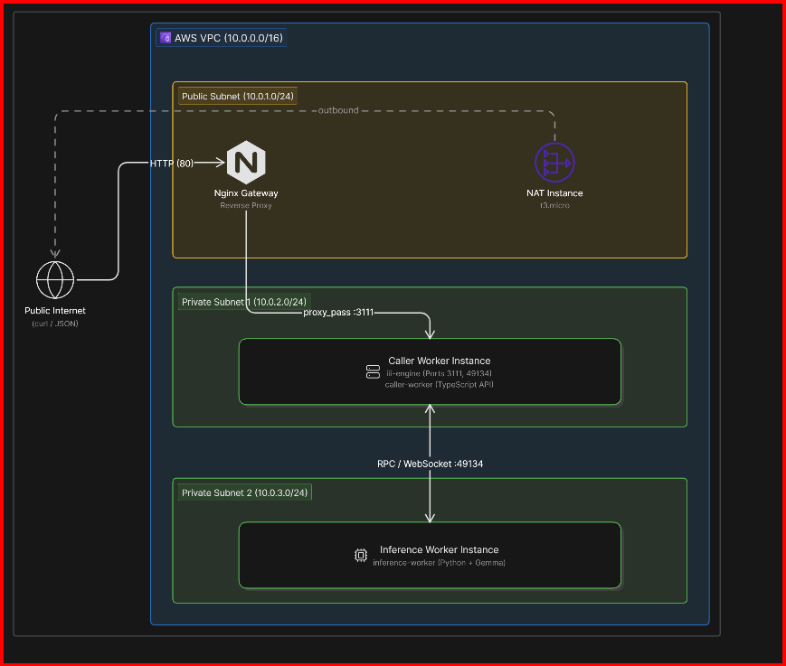

# 🌐 Distributed LLM Inference Mesh


A scalable, production-ready prototype that runs a Small Language Model (SLM) behind a distributed worker mesh. 

This architecture decouples the API tier from the Heavy-Compute Inference tier using a JSON-RPC mesh. The **Python inference worker** hosts the Gemma model and exposes inference as an RPC function, while the **TypeScript API worker** intercepts incoming HTTP requests, routes them to the RPC mesh, and formats the output. Because they are completely decoupled, you can scale the inference tier independently, swap implementations with zero downtime, and extend the mesh as the system grows.

---

## 🏗️ Architecture

The infrastructure is fully deployed on AWS using Terraform. Network hygiene is strictly enforced: workers sit in isolated private subnets and cannot be accessed directly from the public internet.



### 🧩 Components

| Worker | Language | Function | Description |
| :--- | :--- | :--- | :--- |
| **`inference-worker`** | Python | `inference::run_inference` | Loads `gemma-3-270m` (GGUF, Q8), applies the chat template to `messages`, and returns the decoded LLM output. |
| **`caller-worker`** | TypeScript | `inference::get_response` | Calls `inference::run_inference` via RPC with the incoming payload and returns the result. |
| **`caller-worker`** | TypeScript | `http::run_inference_over_http` | HTTP trigger bound to `POST /v1/chat/completions`. Safely parses the HTTP body and forwards it to the RPC mesh. |

---

## 🚀 Quickstart & Deployment

### 1. Prerequisites
Ensure you have the following installed and authenticated on your local machine:
* `docker`
* `terraform`
* `aws-cli`

### 2. Prebuilt Docker Images
If you want to pull the pre-built images directly to test them locally, you can pull them from Docker Hub:
```bash
docker pull sayanC04/caller-worker:latest
docker pull sayanC04/inference-worker:latest
docker pull sayanC04/nginx-serve:latest
```

### 3. Build Your Own Images (Optional)
If you are modifying the source code, you can build and push the customized images to your own Docker Hub repository using the provided bash script:
```bash
chmod +x build_and_push.sh
./build_and_push.sh
# When prompted, enter your Docker Hub username
```

### 4. Deploy Infrastructure via Terraform
Deploy the entire AWS VPC, Subnets, Security Groups, and EC2 Instances using Terraform. 

*Note: You must have an AWS SSH key pair named `llm-mesh-deployer-key` generated using the provided `terraform-key.pub`.*
```bash
cd terraform
terraform init

# Pass your Docker Hub username so Terraform pulls your specific images
terraform apply -var="docker_username=sayanC04"
```
When Terraform completes, it will output the `nginx_public_ip` and an exact `curl_test_command` you can use to test the API!

---

## 📡 API Usage

Once deployed, the API acts similarly to the OpenAI chat completions endpoint. 

**Request:**
```bash
curl -s -X POST http://<NGINX_PUBLIC_IP>/v1/chat/completions \
  -H "Content-Type: application/json" \
  -d '{"messages": [{"role": "user", "content": "Explain quantum computing in one short sentence."}]}'
```

**Response:**
```json
{
  "result": {
    "text": "Quantum computing is a rapidly-emerging technology that harnesses the laws of quantum mechanics to solve problems too complex for classical computers.",
    "success": "You've connected two workers and they're interoperating seamlessly, now let's add a few more workers to expand this project's functionality."
  }
}
```
*(Note: The first request may take ~30 seconds as the Python worker downloads and de-quantizes the Gemma model into RAM. Subsequent requests will be much faster).*

---

## 🛡️ Production Hardening & Scaling

Before putting this architecture into a rigorous production environment, several modifications should be made:

### What to Harden Before Production
1. **Security & Access Control**: The Nginx Gateway currently exposes port 80 (HTTP). This must be secured with TLS/SSL (HTTPS) using a valid certificate (e.g., Let's Encrypt or AWS ACM). Furthermore, the API endpoints lack authentication. An API Gateway (like Kong) or an authorization middleware in the TypeScript worker should be implemented to validate API keys or JWTs.
2. **Network Security**: SSH access (`port 22`) on the Nginx instance is currently open to the entire world (`0.0.0.0/0`). This should be tightly restricted to a specific VPN CIDR or corporate IP address. Ideally, SSH should be disabled entirely in favor of AWS Systems Manager (SSM) Session Manager.
3. **Observability & Logging**: Logs are currently printed to `stdout` within isolated Docker containers. For production, these should be forwarded to a centralized logging system like CloudWatch, Datadog, or an ELK stack.

### What to Do Differently if the Model Were 100x Larger
Serving a massive model (e.g., Llama 3 70B) requires an architectural overhaul:
1. **Hardware Acceleration**: The `t3.medium` CPU instances would be entirely insufficient. We would need GPU-accelerated instances (e.g., `g5` or `p4d` instances on AWS) and configure the Python inference worker to utilize CUDA and multiple GPUs via tensor parallelism (using frameworks like `vLLM` or `TGI`).
2. **Inference Tier Scaling**: A 100x larger model takes significantly longer to infer. We would decouple the inference workers further by deploying them inside an Auto Scaling Group (ASG) or a managed Kubernetes cluster (EKS) where they can horizontally scale out based on request queue depth.
3. **Asynchronous APIs**: Standard HTTP request timeouts would drop connections for massive requests. The API would need to become asynchronous—the Caller worker would immediately return a `job_id`, and the client would poll or receive a webhook/WebSocket push when the GPU inference finally completes.
